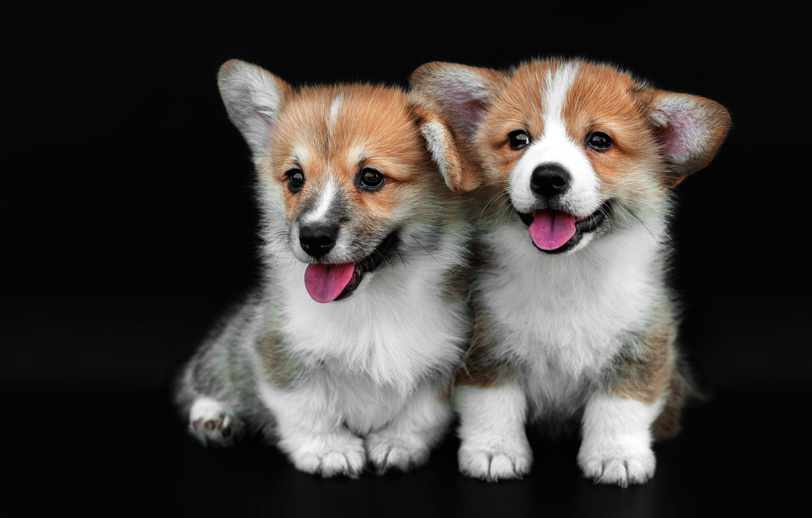
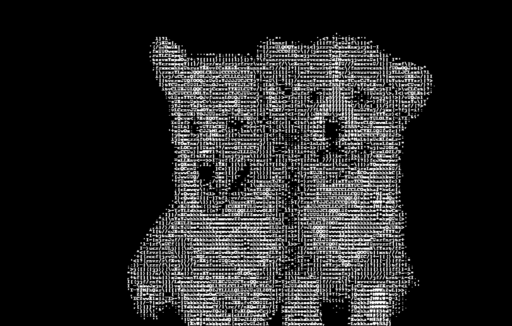

# image_to_ascii
Python program using pygame, numpy and PIL packages. Converts image input to ASCII character output.

## How to run?
-> Clone the repository on your pc.\
-> Edit image path in main.py to pick your image.\
-> Run the program.

## Example

## Things that work
-> Using appropriate image path in main.py.\
-> Proper dimensioning of Pygame window.

## Things to work on
-> Image input dialog, opens file manager and allows user to upload an image instead of typing path.\
-> Maybe make UI prettier...ish.\
-> Video integration.
